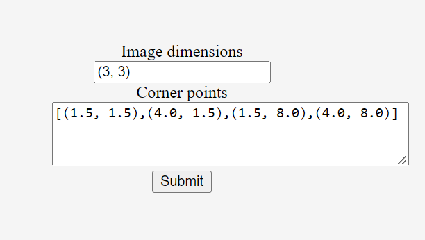

# Fetch Rewards Coding Assessment

## Input Specifications
The program will take two inputs:

### 1. Image dimensions
This will be a tuple defining the height and width of the image in terms of pixel counts. 
```python
img_dim = (3, 3)
```

### 2. Corner Points
This will be a list of two-element tuples defining the x and y coordinates of the image corner points of the displayed image.

```python
corner_points = [
        (1.5, 1.5),
        (4.0, 1.5),
        (1.5, 8.0),
        (4.0, 8.0)
    ]  
```
## Requirements
Docker is required to run this containerized app

## Setup server
1. Clone this repository 
```bash
$ git clone https://github.com/ShubhranshuSingh/fetch_rewards_coding_assessment.git
$ cd fetch_rewards_coding_assessment
```
2. Build Image 
```bash
$ docker build -t flask_app .
```
3. Start flask app
```bash
$ docker run -it -p 5000:5000 flask_app
```
## API
1. Use a browser to access [http://localhost:5000/](http://localhost:5000/). Submit the form after specifying Image dimensions and Corner points as shown below


2. Alternatively, cURL can be used to generate a POST request as follows
```bash
curl -X POST -d 'img_dim=(3, 3)' -d 'corner_points=[(1.5, 1.5),(4.0, 1.5),(1.5, 8.0),(4.0, 8.0)]' http://localhost:5000/
```

## Output
The flask application will return a JSON object similar to the following
```python
{"grid":[[[1.5,8.0],[2.75,8.0],[4.0,8.0]],[[1.5,4.75],[2.75,4.75],[4.0,4.75]],[[1.5,1.5],[2.75,1.5],[4.0,1.5]]]}
```